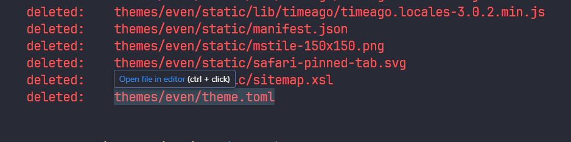

# **阜新初体验**

因为被裁员,再加上想躺平,就来到东北的小城阜新.

这个小城是因煤而兴,也是因煤而败.

目前这个城市老龄化严重,本地是没有什么就业机会的.人口流失也挺严重的.

在我所居住的小区内是随处可见的老人,却很少见到年轻人.年轻人的话,得在这个城市的市北,万达广场附近,相对较为繁华的地方,年轻人才会逐渐在目光所及之处逐渐增多.

#  **房价便宜,生活成本低**

在这里两三万块钱能买到一套房子,当然这个是在这个城市的边缘地区了,这个城市也因为房价便宜,吸引了好多外地人云买房.

在2022年的时候在短视频平台,突然火了起来,当地的中介见这形势,就开启了抬价,把原本两万的房子抬到了三万,在全国楼市都降价的大背景下,阜新的这一波涨价倒还是蛮有阜新特色的.

这里的房子并不都是便宜房子,这里也有一二十万的房子,好的学区房也能有三四十万呢.

# 我的体验

总的来说,这里的生活还算方便,楼下就有早市,周边也有生鲜超市,快递也都能送到.可能是因为这边快递量不多,快递驿站倒没有几个.
快递到了,都是快递员送到楼下,然后给你打电话,让你下来取快递,唯一有一个中通的快递驿站,但是它只收中通的快递.
对于习惯了快递驿站的我来说,这样好几个快递到的话,一天得下楼好几趟,上上下下也是蛮累的.