本文讲述了如何进行金钱管理。
<!--more-->

## 金钱管理

## 1.钱包管理-金钱自由第一课

### 1.1金钱愿景与自我管理

1.有一个清晰的愿景或者目标，具体一下

`smart法则`

s **具体的**  ex: 去太多旅行  自由行/ 跟团 5天4晚（不要说左右）

 m**可衡量**  ex 总花费=机票+酒店+吃喝玩乐+景点+购物

a **可以实现**  ex :出发的时间段 金钱（攒钱计划）

 r  **相关的**  这个目标实现后对自己的意义（为什么是这个目标而不是其他的目标）

 t **时效性** 上面的内容 可以什么时候准备好，确定一个`具体的时间`

### 1.2整理自己的钱包，金钱自由的第一步

对于自己有的东西进行**`断舍离`**

钱包只放与钱有关的东西，好好整理一下。

精简银行卡，保留三张以内，让财富集中。

信用卡还是要少用，三张以内。1张生活消费卡2公司用处的卡（出差垫付等）

`卡的体系`

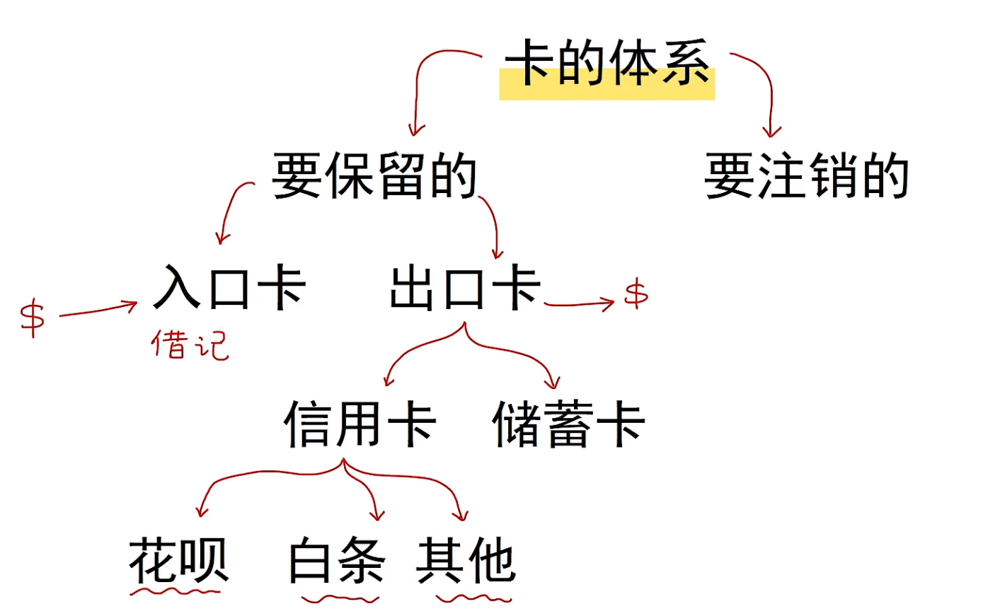

### 1.3金钱管理的大坑（手机支付的时代）

便利的支付就会使我们存钱变得难了许多。

`移动支付难以管理的原因`

1.看不到没感觉

2.没有规划，所以随意

3.没有目标，容易被诱惑

4.大环境(各种消费主义洗脑的广告)

`金钱管理的方法`

开源节流 ： 努力开源，使劲节流

### 1.4信用卡、贷款软件=无法富足

有的人开起来光鲜靓丽，但是背后确实债务缠身。

信用卡、借呗花呗还是需要少用。尽量让自己的债务少一点。

削减一下自己的消费欲望

## 2.存不下钱的原因

### 1.1你真的知道你的财务状况吗？？

恩格尔系数

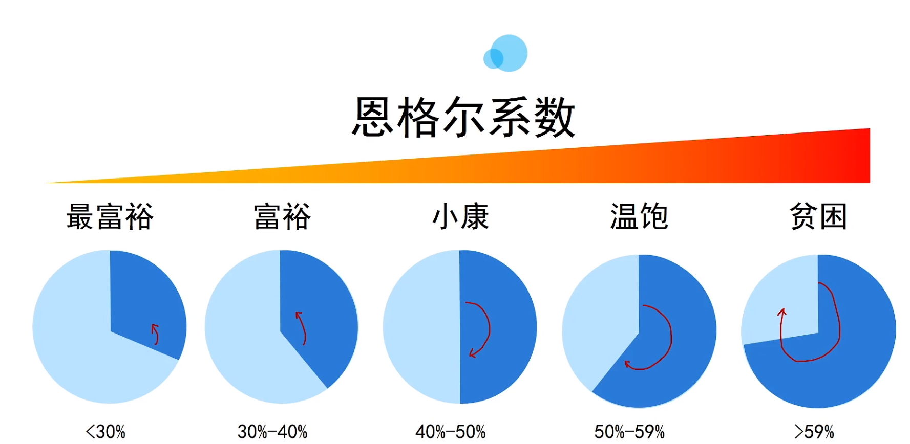

用白纸一边写收入 一边写支出。对比一下看看自己的财务状况究竟是怎样的

要有一个认真整理的账单。梳理一个清晰的财务账单

### 2.2记账app失败的原因

1.账户的设置太复杂了。

2.分类杂乱，相互交叉

3.记录的数据，无法分析，无法调整

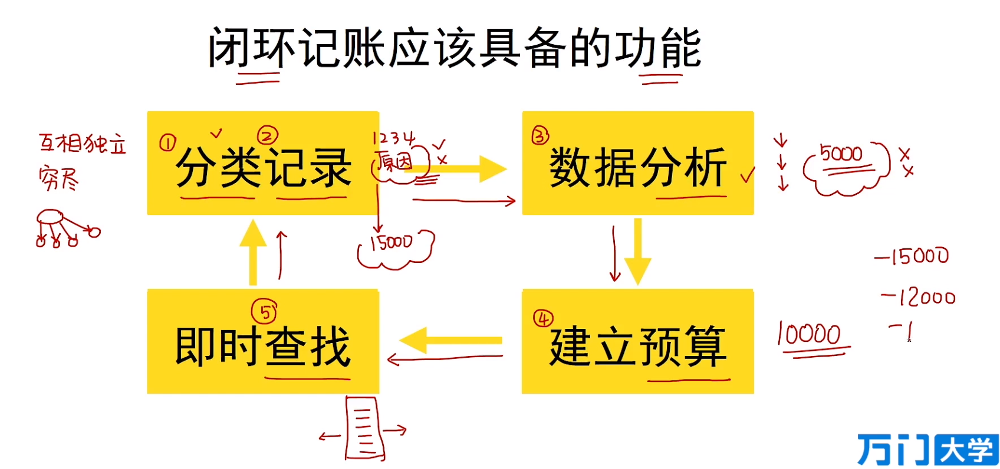

### 2.3神奇的金钱工具：思维导图

略略略，只说了思维导图用思维导图记账

## 3.彻底的金钱整理，从钱包开始

### 3.1如何建立自己与金钱的关系

来自原生家庭的对于金钱的负面信念（各种脑残想法）

1.认为自己无法拥有

2.认为自己的钱无法花在自己身上

3.金钱一定要特别努力才能赚到:x:

4.赚钱一定要特别的手段:x: 各种关系 ，有钱就变坏，谈钱伤感情，闭口不谈

`正面信念`

不要挥霍金钱、加强自我控制能力、让金钱有更大的用处，不要受制于金钱

### 3.2借记卡、信用卡、借贷软件的规划方法

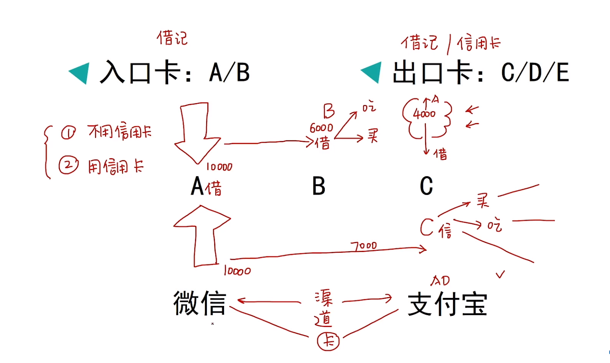

只把微信支付包当做一种渠道 ，把银行卡分为入口卡和出口卡去整理

### 3.3从冰箱入手的‘金钱回流’方法

1.审视冰箱的全貌

2.检查卫生情况

3.觉察购物习惯

4.建立购买规划

`积少成多成就了对待金钱的关系`

## 4搭建账目体系

### 4.1重新认识政府

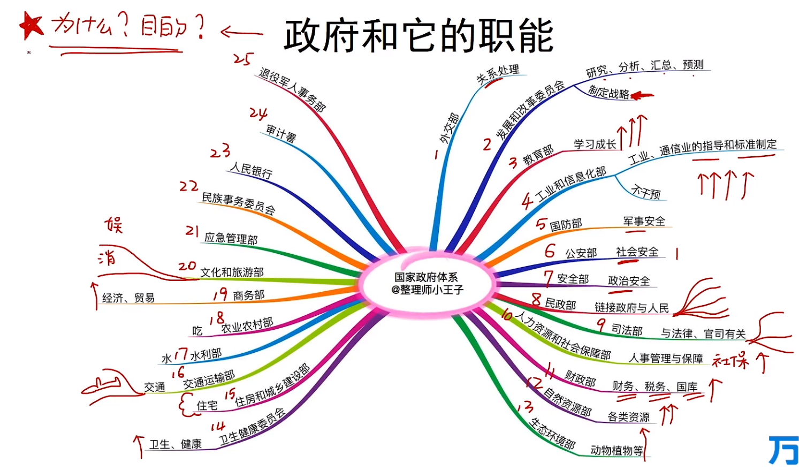

### 4.2用政府思维建立金钱管理体系

1.要列和自己有关的

2.一定要清楚目的是什么 为了什么？？

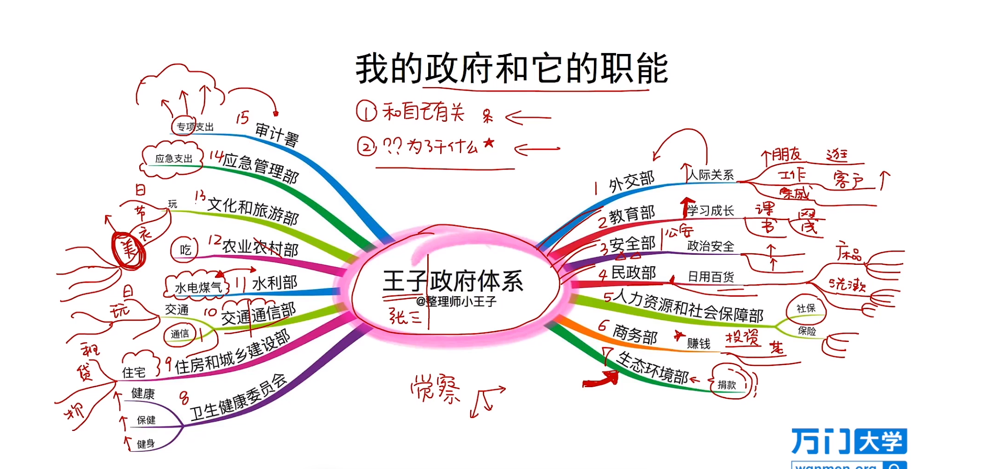

不要出现：其他部门 、 淘宝 、待定

### 4.3特殊的花费如何分类

1.和自己有关2.为什么

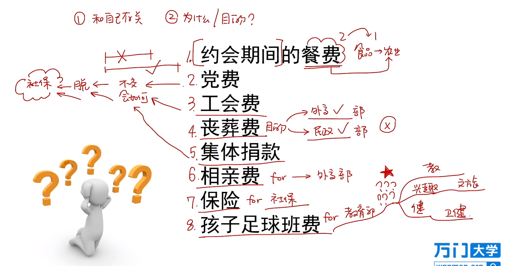

## 5.如何坚持每日记账

### 5.1随时随地每日消费记账

月度记账方法，随时随地很重要

我的政府进行月度统计。

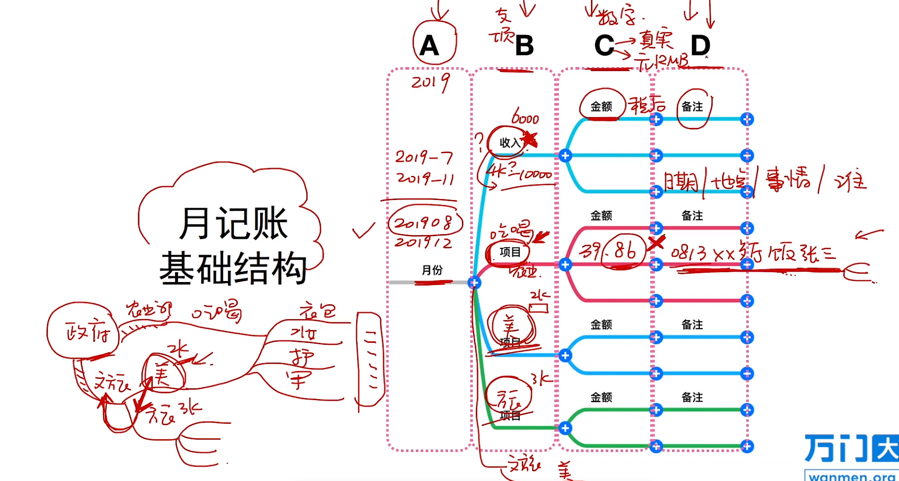

一周为单位来进行觉醒,看一下账单存在什么问题,看看哪里瞎花钱了.

### 5.2暴露物品凌乱程度的记账格式

 严禁乱七八糟,归类!归类!一定要归类 具体事项在备注里面写

账单不要使用模板

### 5.3如何拆解超市的长账单

购物车分区,太麻烦了,我还是喜欢直接超市的账单整个归类为一个.吃吃喝喝

## 6.政府体系与月账单的关系

### 6.1 政府体系与月账单的关系

`政府体系` 

- 宏观架构

- 每月整理

- 底层逻辑

`月账单`

- 微观记录

- 每天记录累计

- 表层数据

### 6.2如何进行大数据分析

数据统计  数据分析   预算建立

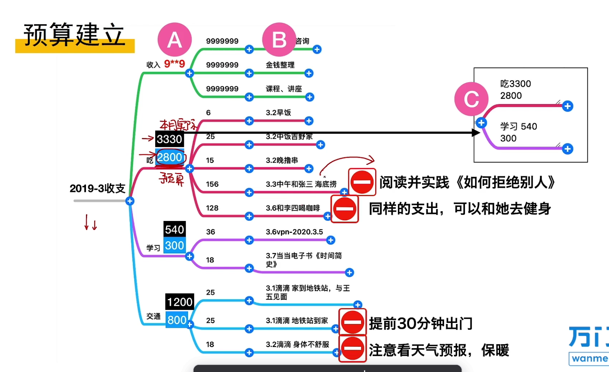

次月的账单可以用上一个月的消费作为下一个月的预算

如果想分析的更直观一点

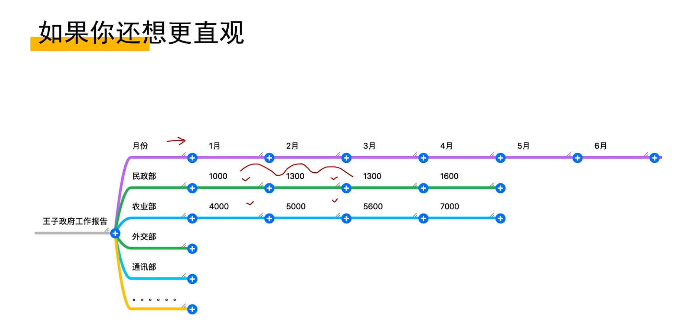

`各个月导图的命名方法`

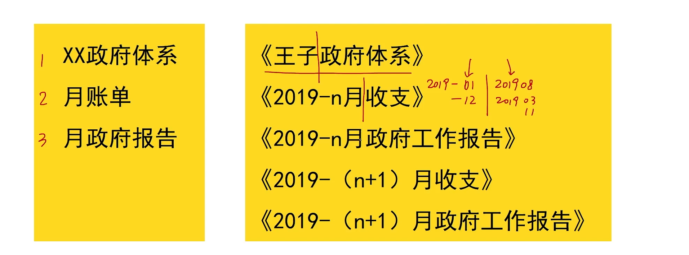

