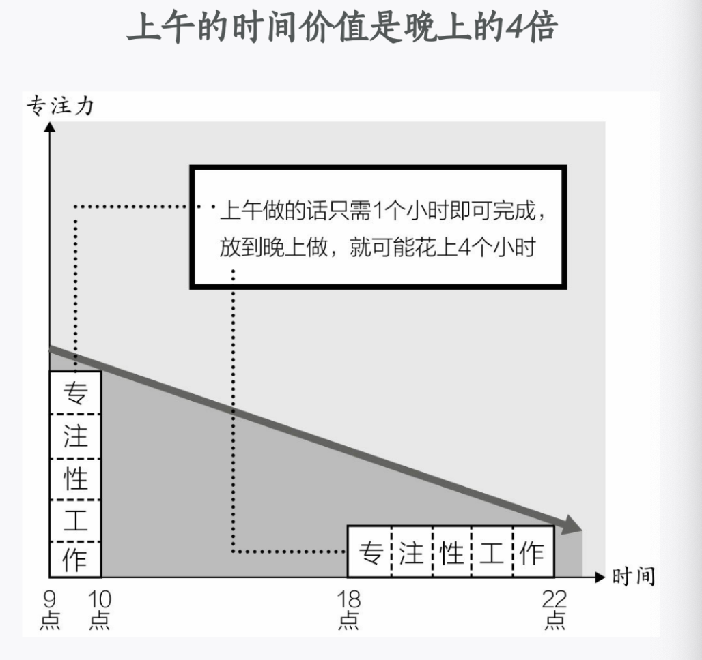
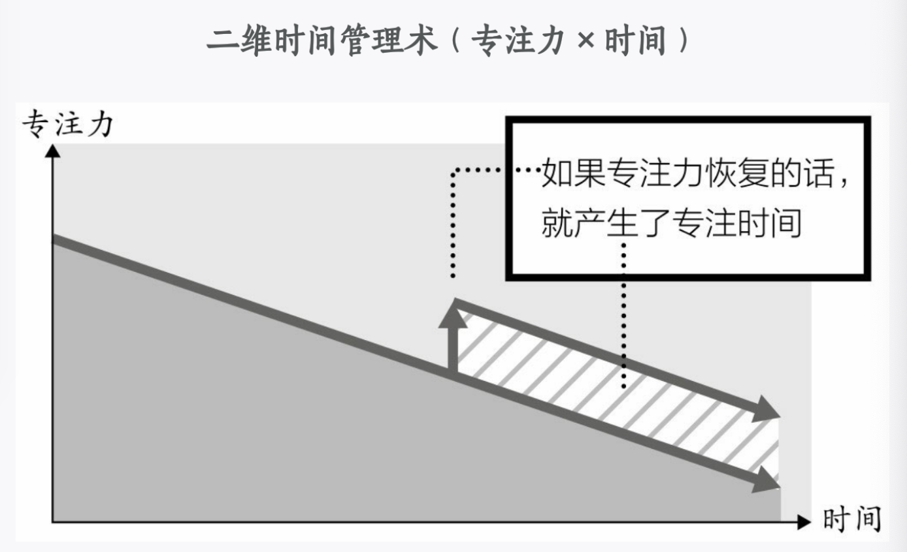
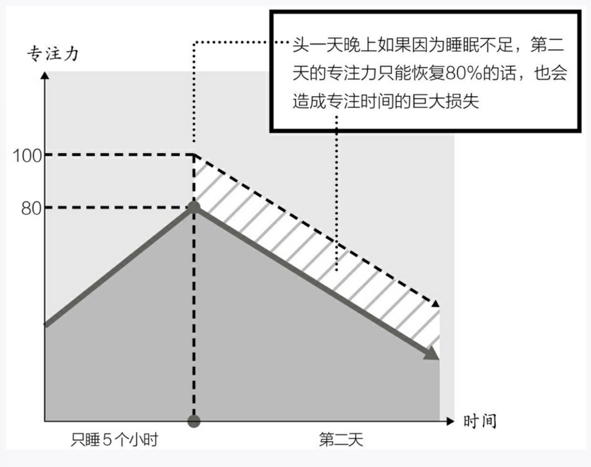
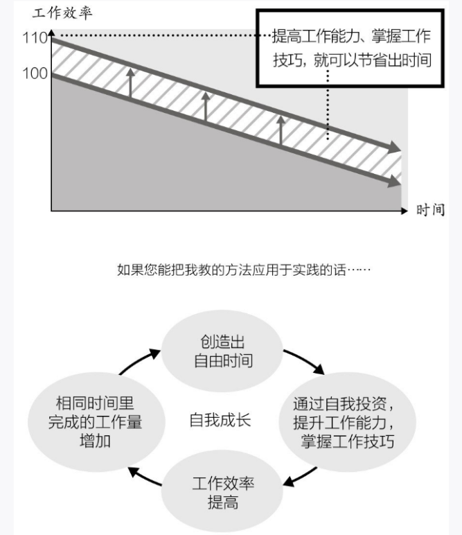
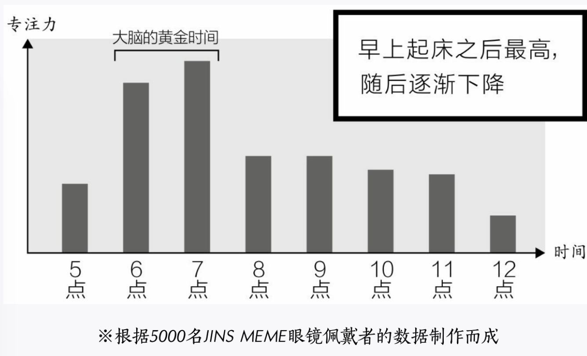
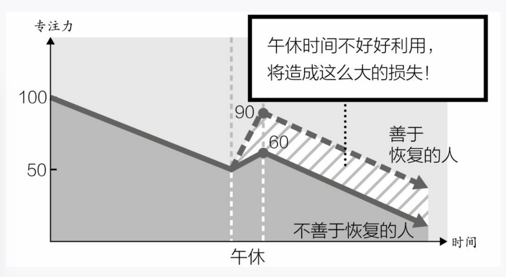
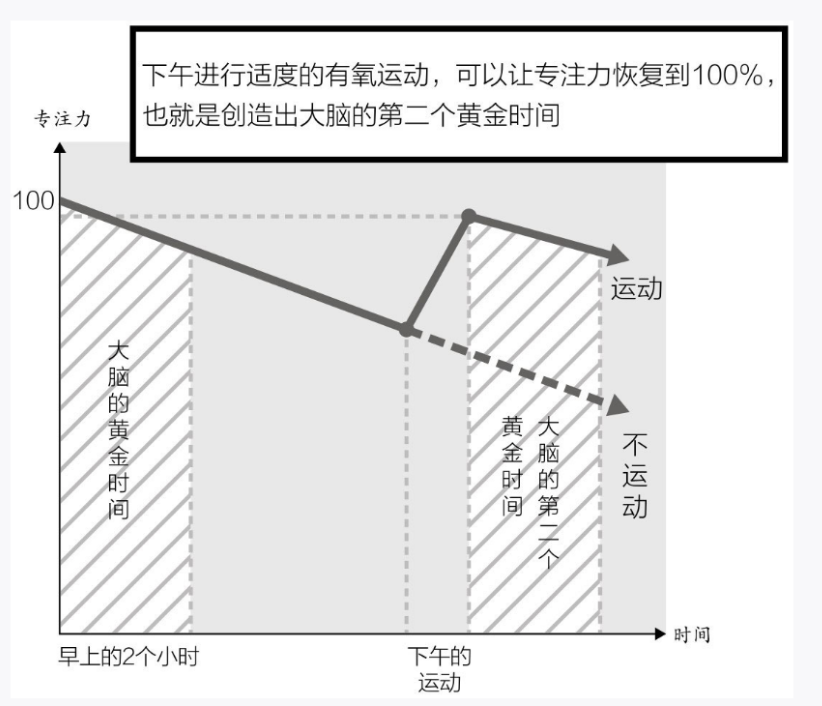
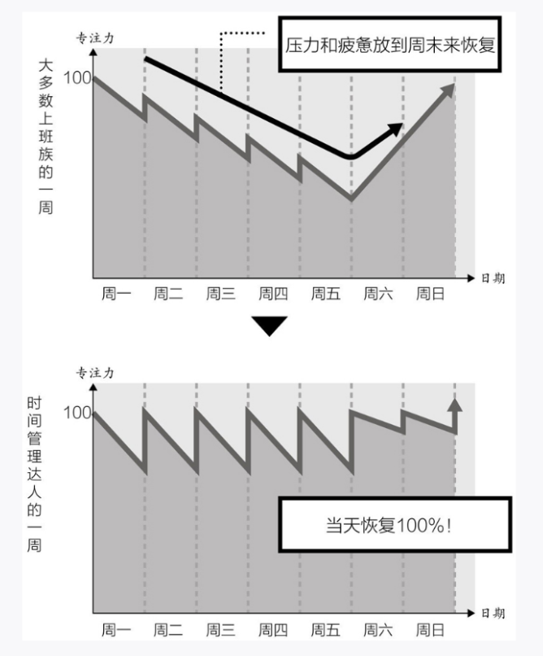
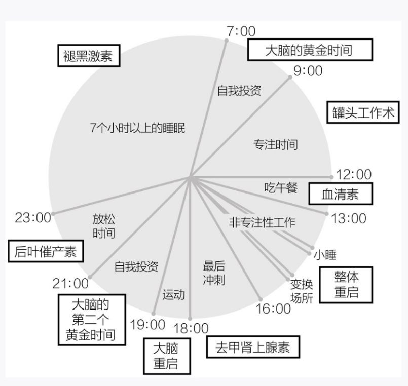

本文讲述了如何进行时间管理。
<!--more-->
## 0.神之管理术四个原则

### 0.1以专注力为中心对时间分配进行思考

干重要的事情一定要在精力充沛的时候,灵活运用大脑的黄金时间,能够提高效率好多倍.

`把握好黄金时间`

我们人类的大脑，在早上起床后的两三个小时里最清醒，也不会感到疲惫，而且经过一晚上的休息，处于一种非常有条理的状态。所以，从早晨到上午的这段时间，是一天中头脑机能最好的时间段。这段时间被称为大脑的黄金时间，特别适合做理论性强的工作，比如创作理论性文章、学习外语以及需要高度专注的工作。

`根据脑科学的理论，在头脑机能最高的时间段，做最适合的工作，可以将工作效率提高到原来的两倍，甚至更高。`

`时间的拼图理论`

工作分为两种:一种需要专注的'专注型工作',一种是不需要专注的非专注型工作.

我们没有办法去提高专注力,因为一个人的精力是有限的的,注意力集中的状态也只能持续两三个小时.

我们就在什么样的时间段,干什么工作,合理安排好时间段的工作,做好计划,工作效率就能够翻倍,甚至更高.

一句话`什么时间干什么事`

### 0.2重启专注力,创造出时间

从一维时间到二维时间管理过渡

普通的时间管理,主要是节约时间,比如地铁上看书...,节约30分钟,就可以把这个三十分钟干其他事情.本质是时间置换.

`二维时间管理术`

专注力(工作效率)x时间=工作量

把握好工作的节奏,在疲劳之前休息,这样就能够保持高效率.提高专注力很难,但是可以提高因为疲劳导致的低专注力.

提高专注力没有什么特别的办法,最管用的方法就是,睡觉.😴

`睡眠不足会导致专注力丧失`

完全重启专注力的秘诀就是`运动`

有氧运动对头脑非常好。在进行有氧运动的时候，头脑会分泌一种名叫`BDNF（brain derived neurotrophic factor，脑源性神经营养因子）`的物质，BDNF对脑神经的成长发育和正常运转起着至关重要的作用。此外，头脑还会分泌一种叫作多巴胺的神经递质，多巴胺能够提高人的兴致，使人产生幸福感。结果，适度运动之后，不仅能提高人的专注力，就连记忆力、思考能力、工作执行能力等多种脑机能都会得到提高。

`重点`**不管发生什么事情都不要压缩睡眠时间**

### 0.3掌握美国式工作的效率

提高工作效率,缩短工作时间,高速度,高质量地把工作做完.

除了提高专注力,其他工作的技巧也要同时实施,专注力不是神药.

在提高专注上下功夫

提高工作效率之后,人就可以从长时间的劳动中解放出来

### 0.4要花时间进行自我投资

很多人把自己通过时间管理创造出来的时间,又来用于工作了,这就是最差劲的时间管理办法.

真正的时间管理术一定是将人从忙碌中解放出来的,而解放出来的时间,应该用来`投资自己`,或者`主动娱乐`,`享受人生`.

> 娱乐的两种方式

一种是`被动性娱乐`,一种是`主动性娱乐`

被动型娱乐:看电视,玩游戏,除了放松没有什么好处

主动性娱乐:读书,运动,学乐器,棋类都可以促进自我的成长.(也算是一种自我投资了)

> 通过自我投资获得无限的成长

通过时间管理创造出来的自由时间,不能浪费到工作上面,用来自我投资.通过学习,主动娱乐来提高自己的个人能力,为日后的工作打基础.

### 0.5最终目标为了快乐而使用时间

工作不是生活的全部,要享受生活.

## 1.最大限度发挥大脑,提高专注力的方法.

### 1.1专注单位管理15-45-90法则

`人高度专注的状态一般只能持续15分钟,不会超过二十分钟.`

可以15分钟看做一个专注单位

人体内还有一种周期性规律，叫作“亚昼夜节律”，英语是“ultradian rhythm”。亚昼夜节律以90分钟为周期。通过研究人类的脑电波，学者发现，人的清醒度会以90分钟为周期发生变化。说得具体一点，人脑比较清醒的90分钟和产生倦意的20分钟会交替来到，形成一个循环。

`每个人的专注单位不一样`可以是15-45-90.也可以是其他时间.不同是事情的专注单位也是不一样的.

### 1.2杂念排除法

想要提高专注力,就需要排除杂念.

杂念的产生就四个原因:

1.外物造成的杂念:   

解决办法:干净整洁的工作环境

2.思考引起的杂念 

解决办法:把心里惦记的事情都写出来

3.人造成的杂念  

尽量寻找相对隔离的环境，最大限度地减少外界的干扰，提高专注力，高效率地推进工作的进展。只要遵循这样的宗旨，我们总能想办法找到合适的地方进行工作。

4.通信造成的杂念.

把手机静音,每隔一段时间查看一下手机.

### 1.3时间限制工作术

通过限制一个具体的紧张时间,提高工作效率.

把大块工作切割成小块的工作,再限制时间.用计时器定时.

`严格的时间设置`

为工作设定时间限制，仅仅是严格遵守这个时间限制就可以让我们的注意力高度集中，提高工作效率。所以，严守时间限制，本身就是一种高效率的工作方法。
严守时间限制的工作方法，说白了就一条，就是在任何情况下都不能推迟设定好的时间限制。

##  2.充分利用大脑的黄金时间

专注性的工作只能在中午之前做,

`超级轻松起床术`

1.早上起床冲个澡,能让我们一天都很清醒.

早上起床后冲个澡能让控制我们身体的“夜晚神经”（放松神经）——副交感神经退居次要位置，把主导权交给“白天神经”（活动神经）——交感神经。

早上冲个温水淋浴，就可以提高体温，加快心跳和呼吸速度，增进血液循环。只需5分钟的温水淋浴，就可以轻松切换副交感神经与交感神经的地位。

2.开着窗帘睡觉

因为早晨的阳光洒在我们身上，可以促进我们脑内一种名叫血清素的神经递质的分泌。
血清素，是一种控制我们睡眠和清醒的神经递质。早上太阳升起来，当温暖的阳光进入我们视网膜的时候，就会把这个刺激传导到位于脑干的“缝线核”。然后大脑开始合成血清素。

**血清素分泌过低，人会患上抑郁症**
人体血清素分泌不足的话，心情就变得很郁闷。早晨醒来，如果感觉“今天什么也不想干”“不想钻出被窝”“就想这样一直躺着”，那很有可能就是体内血清素分泌不足，或者血清素神经的机能比较弱。

开着窗帘睡觉,当早上太阳照在我们身上的时候,即使我们还在睡觉,我们的身体就开始分泌血清素了,这样我们起床就没有那么困难.

3.醒来后躺在床上几分钟在起床

4.有节奏的运动

5.细嚼慢咽吃早餐

我们在咀嚼食物的时候，咀嚼肌会有节奏地收缩、舒张，所以，咀嚼也算是一种有节奏的运动，当然可以促进血清素的分泌，提高血清素的活力。

`早上尽量接触少的信息`

为了让黄金时间维持更长的时间，早晨我不接收多余的信息，姑且先关闭自己的所有“接收天线”，与外界隔绝，专心工作。找出最需要专注力的那项工作,把早晨和上午的时间都分配给它.

## 3.把白天时间利用到极致的午后重启术

`外出吃午餐重启术`

对自己进行彻底的修复,为下午储备能量.

中午了需要提升一下血清素的活力,激发活力也很简单.晒太阳,运动,咀嚼

所以外出吃午餐,能让我们实现这三个动作.一定要在太阳下面晒一会太阳.

`注意`

当我们在做有节奏的运动或咀嚼时，尽量不要同时使用语言机能。因为掌管语言机能的大脑区域活动时，提高血清素活力的效果就会变弱。所以，最好不要一边吃饭，一边读书、说话、工作或思考太多问题。

`提高记忆力的场所神经元`

场所神经元存在于我们大脑的海马体中，是负责掌管场所、空间的神经细胞，也是一种记忆细胞，让我们记住自己在什么地方。

我们可以通过改变场所,唤醒我们的神经元,让我们的海马体更加的活跃

`乙酰胆碱`让我们有灵感.

做点不一样的事情,尝试一些新鲜的事务,能活跃乙酰胆碱.

`午睡很重要`

20-30分钟,没什么好说的.老生常谈.

`我建议大家在午睡前适当喝点咖啡或茶水`。咖啡因会在30分钟后发挥效力，所以小睡30分钟后就会自然醒来。
1个小时的午休时间，前半个小时用来外出吃午饭，剩余的时间用来小睡，刚好能够睡20～30分钟。

`最不好的休息方法是什么`

就是玩手机,这个不能让我们的大脑放松,还会让大脑更加地疲劳.

人类的大脑，处理视觉信息就要占用90%的机能。所以，面对电脑工作的人，仅仅是处理视觉信息就已经相当疲劳了。看、读等行动，会给大脑造成相当大的负担,因此在休息的时候应该从视觉信息中解放出来.

> 让脑力的到恢复的终极休息法

无论工作中还是其他什么时候、什么场所，都可以做。那就是“闭目养神”。只要闭上眼睛，就可以阻断视觉信息的输入，让大脑进入休息模式。

## 4.把夜晚时间利用到极致的运动&睡眠重启术

`运动重启术`

运动之后就是大脑的第二个黄金时间,运动能够帮助我们恢复专注力

但是要注意 不要运动过渡,运动过渡反而会降低专注力

`30分钟左右`的有氧运动之后，人的学习能力、记忆力、积极性都会得到提高。长期运动的习惯，可以促进神经元之间的联系，让头脑变得更聪明。

每天运动三十分钟,可以多活八个小时.

越是感觉时间不够用的人,越是应该抽出时间来运动.

理想的运动时间是在下午地点,但是普通上班族做不到,那就只能是早上运动了.

不管怎样,一周至少运动一次,决定运动后就要坚持到底.

坚持运动之后，和不运动的时候相比，一个月的工作总量几乎是以前的2倍，而且可以自由支配的时间也大幅增加了。

`不让压力和疲惫过夜`

在一天中把握好轻重缓急的节奏.

我们必须像重视白天的工作一样,重视夜晚的休息.

离开公司后,不要想公司的破事了

工作时间就努力、认真、高效率地工作，但下了班，就把工作的事情抛到九霄云外去。

> `对睡眠极好的生活习惯`

早睡决定早起,想要早起就得早睡.

`睡前2个小时千万不能做的事情`有吃东西、饮酒、剧烈运动、洗澡水水温过高、视觉系娱乐（玩电子游戏、看电影等）、看闪亮的东西（看手机、看电脑、看电视等）、待在灯光过于明亮的场所（特别是使用荧光灯的便利店、公司办公室等）。
`睡前2个小时适宜`享受放松。比如，听音乐、闻香薰灯、非视觉系娱乐、和家人聊天、爱抚宠物、使身体放松的轻微运动、温水浴、读书等。

人体内存在交感神经和副交感神经。白天，交感神经处于主导地位，指挥我们努力工作；夜晚，切换到副交感神经工作模式，帮助我们休息、睡眠。交感神经和副交感神经各司其职、各谋其政，才能保证我们在努力工作的同时还能维持身心健康。
夜晚，从交感神经的主导切换到副交感神经的统治，需要一段“冷却”时间。睡前2个小时如果能按照我前面说的去做，您就能顺利“冷却”下来。

`睡前最不应该吃东西`

睡前吃东西的话，睡眠中就不会分泌生长激素了。生长激素具有提高血糖的作用。也就是说，空腹的时候生长激素更容易分泌，而吃饱之后，血糖比较高，就基本上不分泌生长激素了。
在通常情况下，生长激素是在我们入睡之后第一轮快速眼动睡眠的时候分泌。也就是入睡后2个小时之内。但是，如果睡前吃东西的话，那么入睡后2个小时内血糖值还比较高，生长激素就难以分泌。

> 运用好睡前的15分钟

睡前15分钟记忆最好了,看看笔记背背单词最好了.

当我们背诵学习内容的时候，如果之后又有多余的信息进入大脑，就会产生“记忆冲突”，使大脑混乱，对睡眠中大脑进行信息的整理、记忆的固定造成障碍。
睡前15分钟记忆的内容，因为很少受到其他信息的干扰，所以更容易固定在大脑中。

**睡前15分钟不要往大脑输送多余的信息**

睡觉前的15分钟是记忆的黄金时间。这个时候，好的东西容易记住，坏的东西同样容易记住。如果反复想那些“失败体验”，它们就会强烈地留存在我们的记忆中。

> 最好的周末

周末不用刻意补充睡眠.

越是疲惫的时候越是应该去运动,周末的时间相对比较充足,所以应该多运动.

运动可以存进生长激素的分泌

生长激素具有消除疲劳、提高免疫力、修复细胞、促进新陈代谢、抗衰老等功效，绝对是帮上班族朋友消除疲劳、缓解压力的良方。而且，运动过后，人的睡眠会更香、更沉。睡眠质量高了，疲劳自然更容易恢复。

## 5.把工作时间利用到极致

## 5.1foryou 工作术

`Asap`工作术

什么是ASAP？是英语as soon as possible的首字母缩写，字面意思就是“尽可能快”。

我们应该按照工作紧迫度的高低来安排工作顺序，这也是开展商务工作的基本思维方式。但是，如何评价一项工作的紧迫度，却不那么容易。
拿我来说，我会把那些“让别人等待”的工作放在最优先位置处理。也就是说，我在工作中，大脑中始终有一个ASAP意识。

`提前30分钟行动`

`严格守时`

不让别人等待,按照预定时间办事,是对他人最大的尊重.

“For You”，在这里就是“为别人着想”“珍惜别人的时间”的意思。只要我们的大脑中时刻有“For You”的意识，结果为别人省下的时间都会返还到我们的身上，而且还能赢得别人的信任。

但是不能一味地位他人考虑,如果遇到垃圾人,还是要用垃圾态度来对待.

`趁现在`

马上就能做完的事情,就不要往后面拖.

`30秒决断`

考虑30秒和考虑60分钟得到的结果是差不多的，那么考虑30秒就足够了。思考再长的时间，也不会得到更好的判断。

`不是到什么时间为止`而是`什么时间做`

很多人在推迟工作时间的时候，都会以“到××时间为止”的形式设定期限。因为没有设定什么时候开始做，所以往往到期限的时候，依然没有做完。

`把握现在活在当下`

## 6.把自由时间利用到极致的自我投资

### 6.1自由时间不要用于工作

工作不追求量应该追求质

没有轻重缓急的生活，最终等待我们的只有生病。
该休息的时候不休息，造成睡眠不足、运动不足的状态，还连续高强度工作的话，迟早是要生病的。不是身体疾病，就是心理疾病。

如果把自由时间也投入工作的话,那工作时间就会无限增加.

### 6.2投资自己

投资自己的主要专长.让自己的长处越来越长长长长长长长

利用时间管理术创造出来的自由时间用来投资自己，提高工作能力，让自己成长的同时也提高了工作效率，从而创造出更多的自由时间。这样，我们的人生便进入了一个良性循环的轨道。

### 6.3主动性娱乐

读书可以提高专注力,打游戏,看电视会降低专注力.

工作固然重要,学习很重要,娱乐也很重要.

## 玩乐很重要

`活的开心才是最重要的.`
