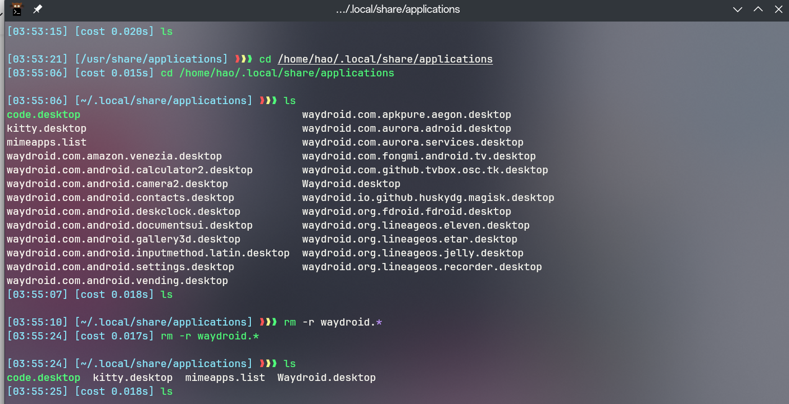

This article records various issues encountered when using Linux.
<!--more-->

## How to delete the remaining Android app icons after uninstalling Waydroid on Manjaro Linux?



## Adding Go to the environment variable
Open zshrc and add the following variable
```bash
export PATH=$PATH:/usr/lib/go/bin

```
## VSCode font settings
This way, the previous English font is JetBrains and the latter is the preferred Chinese font
```json
'JetBrains Mono','LXGW WenKai Mono Screen'
```

## Specifying a certificate for SSH login

```ssh
Host xxxx # host alias
    Hostname xx.xx.xx # ip address
    User root # user name for log in
    IdentityFile ~/.ssh/id_ed25519 

```

## Recommended SSH clients for all platforms

[GitHub - kingToolbox/WindTerm: A professional cross-platform SSH/Sftp/Shell/Telnet/Serial terminal.](https://github.com/kingToolbox/WindTerm)

[FinalShell Official Website](https://www.hostbuf.com/)


## How to install from a local pkgbuild file using yay

To install a software package using a local `PKGBUILD` file with `yay`, follow these steps:

1. **Obtain the `PKGBUILD` file**: First, you need a `PKGBUILD` file, which is usually obtained from AUR or other sources. If you already have this file, ensure it is located in your local file system.

2. **Install `base-devel` and `git`**: Before starting, make sure your system has the `base-devel` and `git` packages installed, as these are necessary for building the package. You can install them with the following command:
   ```
   pacman -S --needed base-devel git
   ```

3. **Clone or download `yay`**: If you haven't installed `yay`, you can clone its repository from AUR and install it. Use the following commands:
   ```
   git clone https://aur.archlinux.org/yay.git
   cd yay
   makepkg -si
   ```
   This will build and install `yay`. After installation, you can verify that `yay` has been successfully installed by running `yay --version`.

4. **Use `yay` to install a local `PKGBUILD`**: Once you have the `PKGBUILD` file and `yay`, you can use `yay` to install the local `PKGBUILD`. Assuming your `PKGBUILD` file is in a certain directory, you can use the following command:
   ```
   yay -Bi <directory>
   ```
   Here `<directory>` is the path to the directory containing your `PKGBUILD` file. The `-Bi` option tells `yay` to install dependencies and build the local `PKGBUILD`.

5. **Confirm the installation**: After the build is complete, `yay` will prompt you to confirm the installation. Follow the instructions on the screen, usually by pressing `Y` to confirm.

6. **Verify the installation**: After the installation is complete, you can use `yay` to verify whether the package has been successfully installed, or use `pacman` to query the list of installed packages.

The above steps provide a basic guide on how to install packages using a local `PKGBUILD` file with `yay`. Please ensure you follow all security practices, as building packages from AUR or other unofficial sources may pose security risks.

## How to install historical versions of AUR third-party software on Manjaro
First, find the AUR page of the target software, then clone the repository
Then use
```bash
git log
git checkout xxxxx
pamac build
```
## How to code on an Android phone

First, install [Termux](https://termux.dev/en/)

Then launch termux,
Install necessary tools (golang java)
```bash
pkg install git 
pkg install neovim 
pkg install golang 
pkg install openjdk-21
```
Then configure nvim according to your needs, lazy people can use [🚀LazyVim](https://www.lazyvim.org/)
```bash
git clone https://github.com/LazyVim/starter ~/.config/nvim

```
Then launch nvim to automatically load the required plugins, and you can happily code on your phone.


## how to brew unlink then relink

### brew – unlinking a package
First run the following to unlink imagamagick.
```bash
$ brew unlink imagemagick
Unlinking /usr/local/Cellar/imagemagick/6.9.2-7... 72 symlinks removed
```
### brew – linking a package
Run the following to link imagamagick in dryrun mode. This will also list down what all will get linked.
```bash
$ brew link imagemagick --dry-run
To do actual linking run the following
$ brew link imagemagick
Linking /usr/local/Cellar/imagemagick/6.9.2-7... 71 symlinks created
```
To see if link has been for created for one command (e.g. convert), run the following

```bash
$ ls -l $(brew --prefix)/bin/convert
```
Note that brew --prefix will list the brew prefix for installation.


## How to get weather information in the terminal

One command to rule them all

```bash
curl wttr.in
```

If you want to specify a location, you can add the location information after it.

```bash
curl wttr.in/ueno
Weather report: ueno

      \   /     Sunny
       .-.      +9(5) °C
    ― (   ) ―   ↘ 37 km/h
       `-’      10 km
      /   \     0.0 mm
```

>> [!Tip] For other specific parameters, refer to GitHub[chubin/wttr.in](https://github.com/chubin/wttr.in)