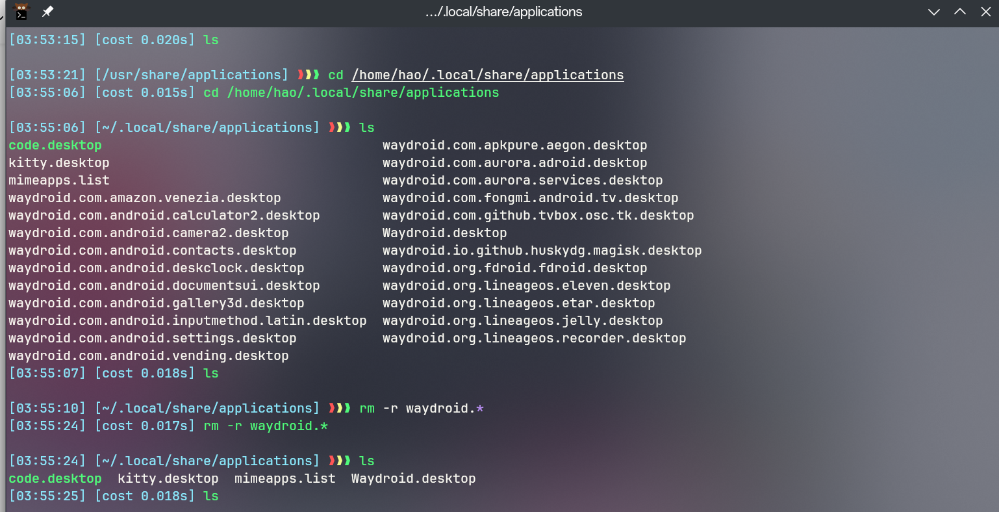

本文は、Linuxを使用する際に遭遇した様々な問題を記録しています。
<!--more-->

## manjaro linux からwaydroidをアンインストールした後、残ったAndroidアプリアイコンを削除する方法は？



## 環境変数にgoを追加する
zshrcを開いて以下の変数を追加します。
```bash
export PATH=$PATH:/usr/lib/go/bin
```

## vscodeでフォントを設定する
このように前の英語フォントはjetbrains、後の中国語フォントは好みのものにします。
```json
'JetBrains Mono','LXGW WenKai Mono Screen'
```

## sshログインに特定の証明書を指定する

```ssh
Host xxxx # ホストエイリアス
    Hostname xx.xx.xx # IPアドレス
    User root # ログインするユーザー名
    IdentityFile ~/.ssh/id_ed25519 
```

## おすすめのsshマルチプラットフォームクライアント

[GitHub - kingToolbox/WindTerm: クロスプラットフォームのSSH/Sftp/Shell/Telnet/Serialターミナルです。](https://github.com/kingToolbox/WindTerm)

[FinalShell公式サイト](https://www.hostbuf.com/)


## ローカルpkgbuildファイルからyayでインストールする方法

ローカルの `PKGBUILD` ファイルを使用して `yay` でパッケージをインストールするには、以下の手順に従ってください。

1. **`PKGBUILD` ファイルの取得**：まず、`PKGBUILD` ファイルが必要です。これは通常、AURやその他のソースから取得されます。すでにファイルをお持ちの場合は、ローカルファイルシステムに配置されていることを確認してください。

2. **`base-devel` と `git` のインストール**：始める前に、システムに `base-devel` と `git` パッケージがインストールされていることを確認してください。これらはパッケージをビルドするために必要です。以下のコマンドを使用してインストールできます：
   ```
   pacman -S --needed base-devel git
   ```

3. **`yay` のクローンまたはダウンロード**：`yay` をまだインストールしていない場合は、AURからリポジトリをクローンしてインストールできます。以下のコマンドを使用してください：
   ```
   git clone https://aur.archlinux.org/yay.git
   cd yay
   makepkg -si
   ```
   これにより `yay` がビルドされインストールされます。インストールが完了したら、`yay --version` を実行して `yay` が正常にインストールされたことを確認できます。

4. **ローカル `PKGBUILD` での `yay` インストール**：`PKGBUILD` ファイルと `yay` を準備ができたら、`yay` を使用してローカルの `PKGBUILD` をインストールできます。`PKGBUILD` ファイルがあるディレクトリを指定してください：
   ```
   yay -Bi <ディレクトリ>
   ```
   ここで `<ディレクトリ>` は `PKGBUILD` ファイルが含まれるディレクトリのパスです。`-Bi` オプションは `yay` に依存関係をインストールしてローカル `PKGBUILD` をビルドするように指示します。

5. **インストールの確認**：ビルドが完了すると、`yay` がインストールを確認するプロンプトが表示されます。画面上の指示に従って、通常は `Y` を押して確認してください。

6. **インストールの検証**：インストールが完了したら、`yay` を使用してパッケージが正常にインストールされたことを確認したり、`pacman` を使用してインストールされたパッケージのリストを確認したりできます。

以上の手順は、ローカル `PKGBUILD` ファイルを使用して `yay` でパッケージをインストールする方法の基本的なガイドラインを提供します。すべてのセキュリティプラクティスに従ってください。AURやその他の非公式ソースからパッケージをビルドすることはセキュリティリスクをもたらす可能性があります。

## manjaroでaurのサードパーティソフトウェアの古いバージョンをインストールする方法
まず、対象ソフトウェアのaurページを見つけ、リポジトリをクローンダウンします。
次に使用します。
```bash
git log
git checkout xxxxx
pamac build
```

## アンドロイド携帯でコードを書く方法

まず、[Termux](https://termux.dev/en/) をインストールします。

次にtermuxを起動し、必要なツール（golang java）をインストールします。
```bash
pkg install git 
pkg install neovim 
pkg install golang 
pkg install openjdk-21
```
次に自分のニーズに応じてnvimを設定します。手間がかかる人は[🚀LazyVim](https://www.lazyvim.org/)を使用できます。
```bash
git clone https://github.com/LazyVim/starter ~/.config/nvim

```
次にnvimを起動して必要なプラグインを自動的に読み込み、携帯でコードを楽しく書くことができます。


## どのようにして brew unlinkしてから再びlinkさせるか

### brew パッケージのunlink
まず、以下のコマンドを実行してimagemagickをunlinkします。
```bash
$ brew unlink imagemagick
/usr/local/Cellar/imagemagick/6.9.2-7...から72個のシンボリックリンクが削除されました
```
### brew パッケージのrelink
以下のコマンドを実行して、dryrunモードでimagemagickをlinkします。これにより、何がlinkされるかが一覧表示されます。
```bash
$ brew link imagemagick --dry-run
実際のlinkを実行するには、以下のコマンドを実行します
$ brew link imagemagick
/usr/local/Cellar/imagemagick/6.9.2-7...に71個のシンボリックリンクが作成されました
```
linkが作成されたかどうかを確認するには（例：convertコマンドの場合）、以下のコマンドを実行します。

```bash
$ ls -l $(brew --prefix)/bin/convert
```
brew --prefixはインストールのためのbrewのプレフィックスを一覧表示します。