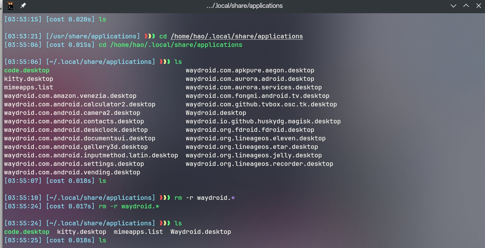

本文记录了使用linux遇到的各种问题
<!--more-->

## manjaro linux 中卸载waydroid后，遗留的安卓app图标如何删除？



## 把go加入环境变量
打开zshrc添加以下变量
```bash
export PATH=$PATH:/usr/lib/go/bin

```
## vscode设置字体
这样前一个英文字体是jetbrains 后一个就是喜欢的中文字体
```json
'JetBrains Mono','LXGW WenKai Mono Screen'
```

## 为ssh登录指定证书

```ssh
Host xxxx # host alias
    Hostname xx.xx.xx # ip address
    User root # user name for log in
    IdentityFile ~/.ssh/id_ed25519 

```

## 好用的ssh全平台客户端推荐

[GitHub - kingToolbox/WindTerm: A professional cross-platform SSH/Sftp/Shell/Telnet/Serial terminal.](https://github.com/kingToolbox/WindTerm)

[FinalShell官网](https://www.hostbuf.com/)


## 如何使用yay 从本地pkgbuild文件安装

要使用本地的 `PKGBUILD` 文件来通过 `yay` 安装软件包，你可以按照以下步骤操作：

1. **获取 `PKGBUILD` 文件**：首先，你需要有一个 `PKGBUILD` 文件，这通常是从 AUR 或其他来源获得的。如果你已经有了这个文件，确保它位于你的本地文件系统中。

2. **安装 `base-devel` 和 `git`**：在开始之前，确保你的系统中安装了 `base-devel` 和 `git` 包，因为这些是构建软件包所必需的。你可以使用以下命令来安装它们：
   ```
   pacman -S --needed base-devel git
   ```

3. **克隆或下载 `yay`**：如果你还没有安装 `yay`，你可以从 AUR 克隆它的仓库并安装。使用以下命令：
   ```
   git clone https://aur.archlinux.org/yay.git
   cd yay
   makepkg -si
   ```
   这将构建并安装 `yay`。安装完成后，你可以通过运行 `yay --version` 来验证 `yay` 是否已成功安装。

4. **使用 `yay` 安装本地 `PKGBUILD`**：一旦你有了 `PKGBUILD` 文件和 `yay`，你可以使用 `yay` 来安装本地的 `PKGBUILD`。假设你的 `PKGBUILD` 文件位于某个目录，你可以使用以下命令：
   ```
   yay -Bi <目录>
   ```
   这里的 `<目录>` 是包含你的 `PKGBUILD` 文件的目录的路径。`-Bi` 选项告诉 `yay` 安装依赖并构建本地 `PKGBUILD`。

5. **确认安装**：构建完成后，`yay` 将提示你确认安装。按照屏幕上的指示操作，通常需要按 `Y` 来确认。

6. **验证安装**：安装完成后，你可以使用 `yay` 来验证软件包是否已成功安装，或者使用 `pacman` 来查询已安装的软件包列表。

以上步骤提供了一个基本的指南，如何使用本地 `PKGBUILD` 文件通过 `yay` 安装软件包。请确保你遵循所有安全实践，因为从 AUR 或其他非官方源构建软件包可能会带来安全风险。

## manjaro如何安装aur第三方软件的历史版本
首先，找到目标软件的aur页面，然后把仓库clone下来
然后使用
```bash
git log
git checkout xxxxx
pamac build
```
## 如何在安卓手机上写代码

首先，安装[Termux](https://termux.dev/en/)

然后启动termux，
安装必要的工具（golang java）
```bash
pkg install git 
pkg install neovim 
pkg install golang 
pkg install openjdk-21
```
然后根据自己需要去配置nvim，懒人可以用[🚀LazyVim](https://www.lazyvim.org/)
```bash
git clone https://github.com/LazyVim/starter ~/.config/nvim

```
然后启动nvim自动加载所需要的插件，然后就可以愉快地在手机上写代码了。

## 如何在brew unlink 之后重新link

### brew – unlinking a package
First run the following to unlink imagamagick.
```bash
$ brew unlink imagemagick
Unlinking /usr/local/Cellar/imagemagick/6.9.2-7... 72 symlinks removed
```
### brew – linking a package
Run the following to link imagamagick in dryrun mode. This will also list down what all will get linked.
```bash
$ brew link imagemagick --dry-run
To do actual linking run the following
$ brew link imagemagick
Linking /usr/local/Cellar/imagemagick/6.9.2-7... 71 symlinks created
```
To see if link has been for created for one command (e.g. convert), run the following

```bash
$ ls -l $(brew --prefix)/bin/convert
```
Note that brew --prefix will list the brew prefix for installation.


## 如何在终端中获取天气信息

一条命令搞定

```bash
curl wttr.in
```


如果想指定位置,可以在后面加上位置信息.

```bash
curl wttr.in/ueno
Weather report: ueno

      \   /     Sunny
       .-.      +9(5) °C
    ― (   ) ―   ↘ 37 km/h
       `-’      10 km
      /   \     0.0 mm
```

>> [!Tip] 其他具体参数参考GitHub[chubin/wttr.in](https://github.com/chubin/wttr.in)


## 如何让 Hugo 博客根据浏览器的语言设置自动选择相应的语言。

首先设置 `defaultContentLanguageInSubdir = true`。

然后在 /layouts/ 下添加一个名为 alias.html 的文件。

然后将下面的代码复制到 alias.html 中。


```html
<!DOCTYPE html>
<html>
<head>
    <title>{{ .Permalink }}</title>
    <link rel="canonical" href="{{ .Permalink }}"/>
    <meta name="robots" content="noindex">
    <meta charset="utf-8"/>
    <noscript>
        <meta http-equiv="refresh" content="0; url={{ .Permalink }}"/>
    </noscript>
    <script>
      ;(function () {
        // Only do i18n at root, 
        // otherwise, redirect immediately
        if (window.location.pathname !== '/') {
          window.location.replace('{{ .Permalink }}')
          return
        }

        var getFirstBrowserLanguage = function () {
          var nav = window.navigator,
          browserLanguagePropertyKeys = ['language', 'browserLanguage', 'systemLanguage', 'userLanguage'],
          i,
          language

          if (Array.isArray(nav.languages)) {
            for (i = 0; i < nav.languages.length; i++) {
              language = nav.languages[i]
              if (language && language.length) {
                return language
              }
            }
          }

          // support for other well known properties in browsers
          for (i = 0; i < browserLanguagePropertyKeys.length; i++) {
            language = nav[browserLanguagePropertyKeys[i]]
            if (language && language.length) {
              return language
            }
          }
          return 'en'
        }

        var preferLang = getFirstBrowserLanguage()
        if (preferLang == 'ja' ){
          // visitor prefers Chinese
          window.location.replace('/ja/')
        }
        else if (preferLang.indexOf('zh') !== -1) {
          // visitor prefers Chinese
          window.location.replace('/zh-cn/')
        } else {
          // fallback to English
          window.location.replace('/en/')
        }
      })()
    </script>
</head>
<body>
<h1>Rerouting</h1>
<p>You should be rerouted in a jiff, if not, <a href="{{ .Permalink }}">click here</a>.</p>
</body>
</html>

```


## ssh 连接总是断开怎么办?

修改一下sshd的配置 

```bash
sudo nvim /etc/ssh/sshd_config 
# set TCPKeepAlive yes 
TCPKeepAlive yes 
```
然后重启sshd

```bash
 sudo systemctl restart sshd 
```