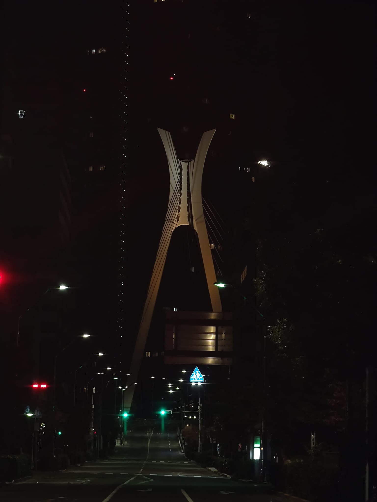
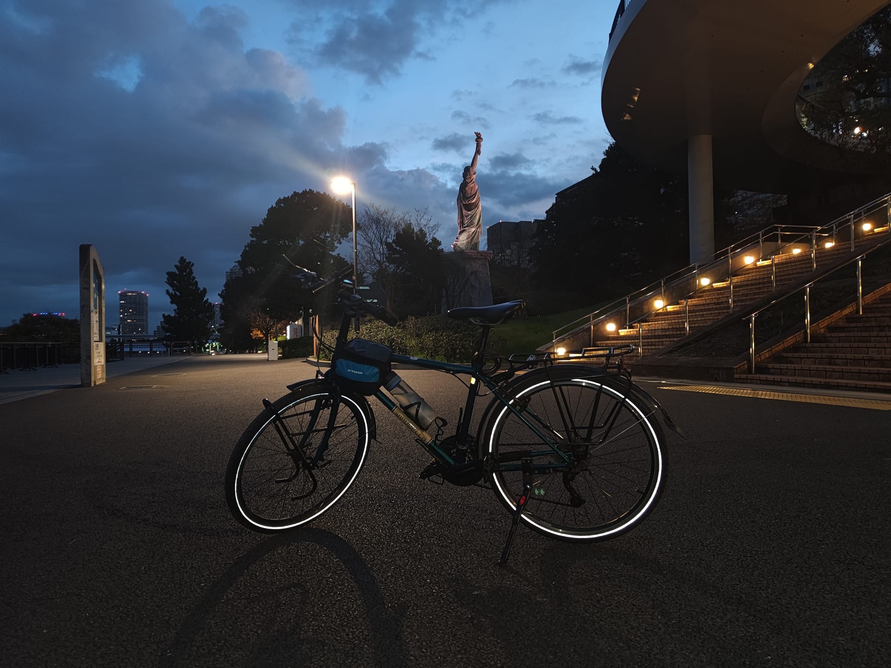
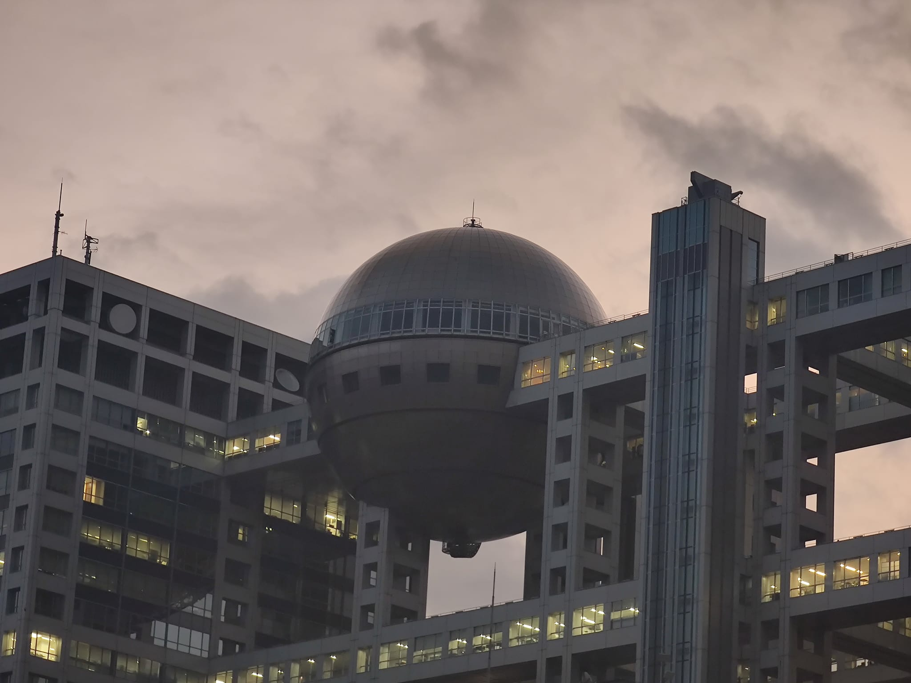
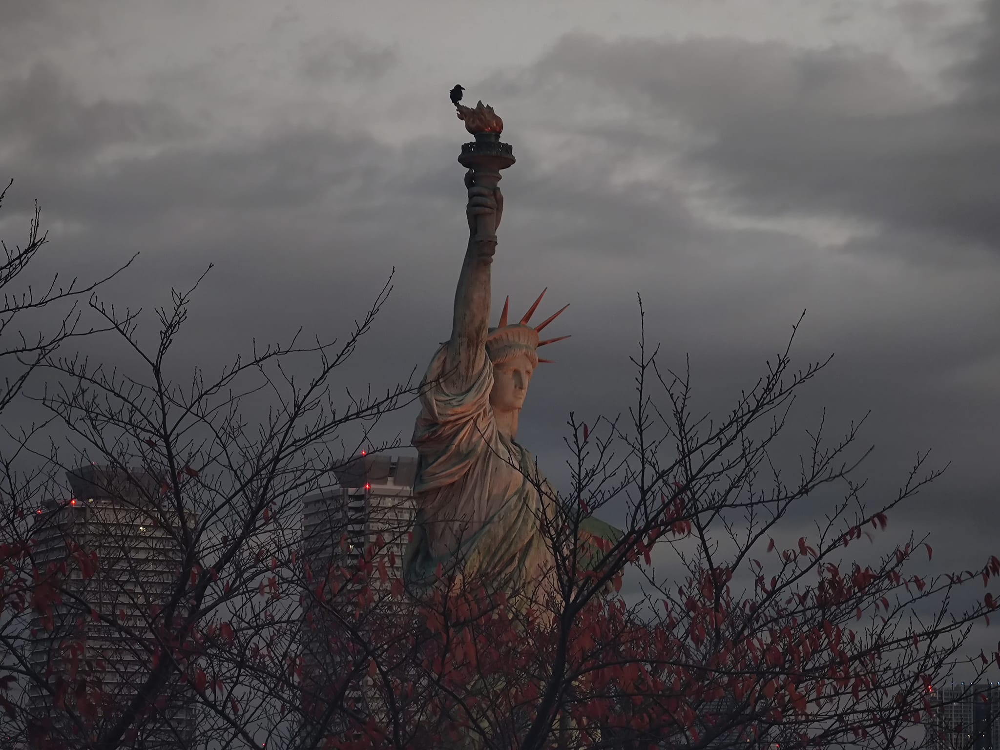
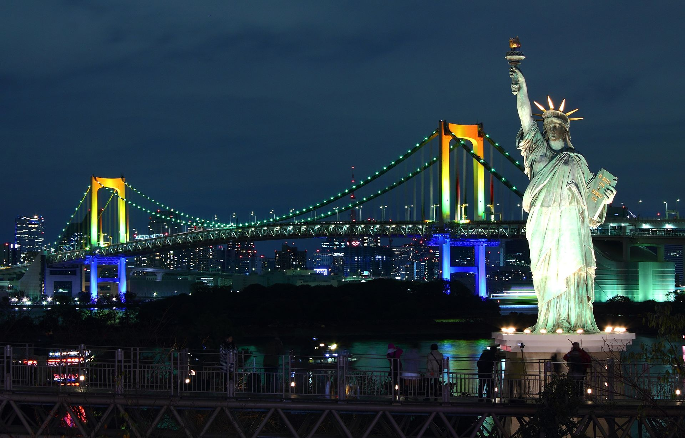

This article records an experience of riding a bike to Odaiba one night when I couldn't sleep.

<!--more-->

## Can't Sleep, Go for a Ride

Recently, I've been suffering from insomnia, so I often don't sleep well or have fun. When I can't sleep, I just go for a bike ride. After coming back from the ride, I'm physically and mentally exhausted, which naturally makes it easier to fall asleep. It's a good way to fall asleep, albeit a bit physically draining, especially since it's been quite cold lately.

## Riding Experience

Speaking of the experience, it's average because to get to Odaiba, you have to take the main roads with many traffic lights. Fortunately, I set off at five in the morning when there weren't many cars on the road. On the way back, it was almost eight, and the traffic had picked up, making the riding experience quite uncomfortable.

Odaiba has many overpasses, and it's easy to take a wrong turn if you're not careful.

## Odaiba Seaside Park

Odaiba Seaside Park is quite nice; you can see the Tokyo Tower from a distance.

There is also a Statue of Liberty. For more about the origin of the Statue of Liberty, please refer to the Wikipedia page [Statue of Liberty - Wikipedia](https://en.wikipedia.org/wiki/Statue_of_Liberty#Tokyo)

## Odaiba
`The bridge I encountered on the way to Odaiba, from a distance, it looks a bit like a monster.`

`A photo of the bicycle and the Statue of Liberty`

`A building that feels very technological.`

`The Statue of Liberty in Odaiba`

`The Hilton Hotel in Odaiba`

