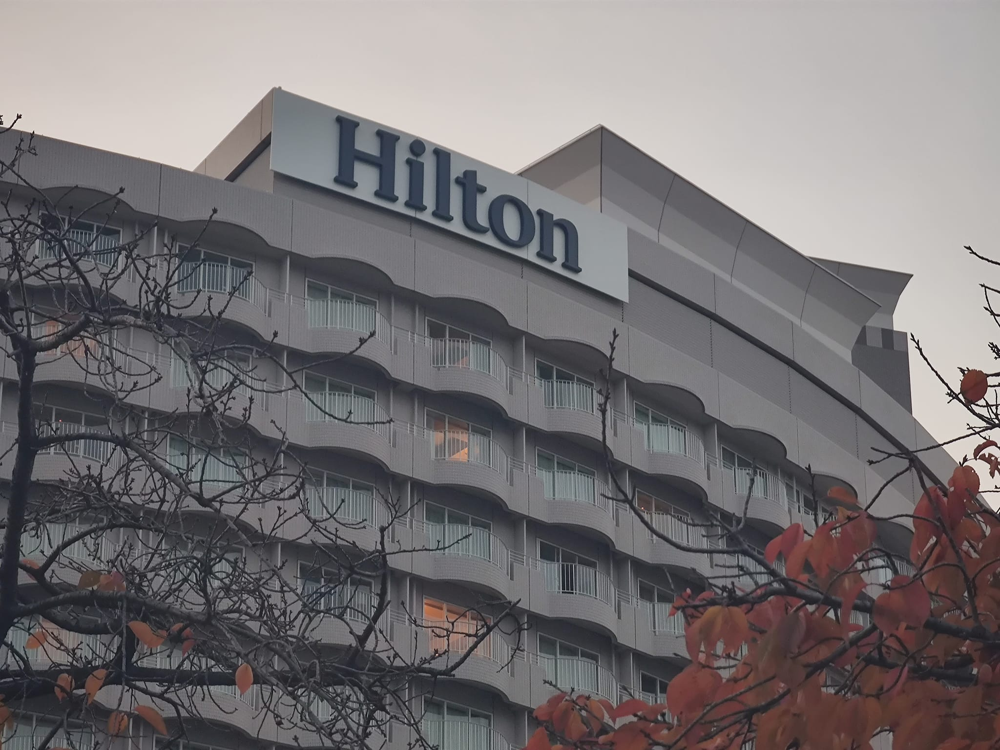

この記事では、ある夜眠れずに、朝に自転車で台場に行った経験を記録しました。

<!--more-->

## 眠れなければ自転車に乗って行きましょう

最近はよく不眠症で、よく眠くても遊んでもよくないので、眠れなければ自転車 RIDE に行きましょう。自転車 RIDE に戻ってきて、体と心が疲れてきます。
自然と眠くなります。これは睡眠の良い方法ですが、少し体力を消耗しますし、最近は本当に寒くなっています。

## 自転車に乗る体験

体験的には、普通です。台場に行くには大通りを通らなければならず、信号がたくさんありますが、幸いにも午前5時に出発したので、車は多くありませんでした。8時ごろに戻ると、車が多くなり、自転車 RIDE 体験はとても心地悪くなります。

台場には多くの高層橋があって、気をつけないと道に迷うことがあります。

## 台場海浜公園

台場海浜公園はなかなか良いです。遠くから東京タワーが見えます。

自由の女神像もあります。自由の女神像の詳細については、ウィキペディアを参照してください[自由の女神像 - Wikipedia](https://ja.wikipedia.org/wiki/%E8%87%AA%E7%94%B1%E3%81%AE%E5%A5%B3%E7%A5%9E%E5%83%8F#%E6%9D%B1%E4%BA%AC%E9%83%BD%E6%B8%AF%E5%8C%BA)

## 台場
`台場に行く途中に遭遇した橋、遠くから見ると少しモンスターに見える`

`自転車と自由の女神像の記念撮影`

`とてもハイテクな感じのビル`

`台場の自由の女神像`

`台場のヒルトンホテル`

