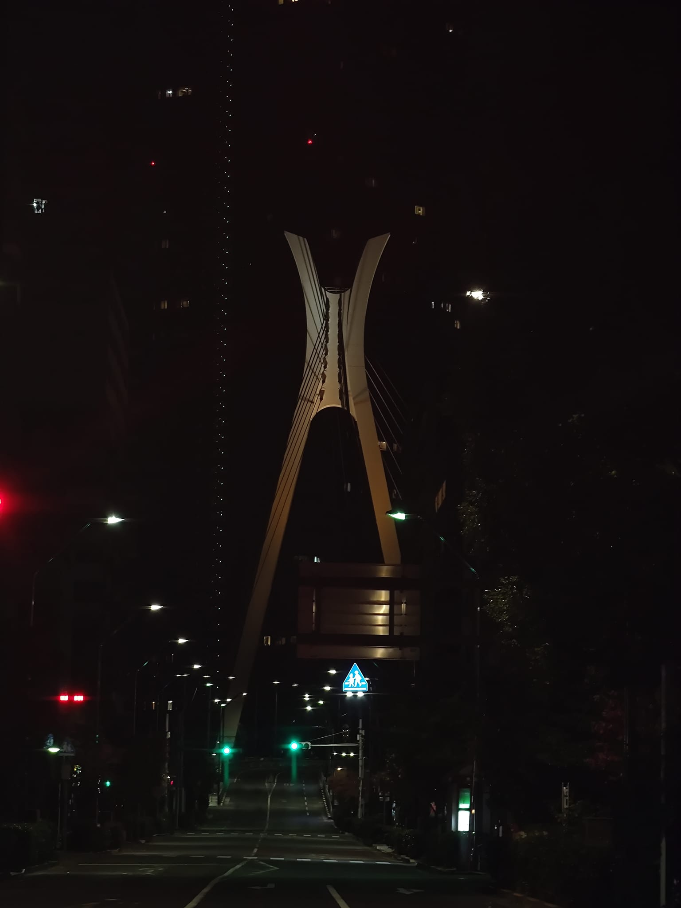
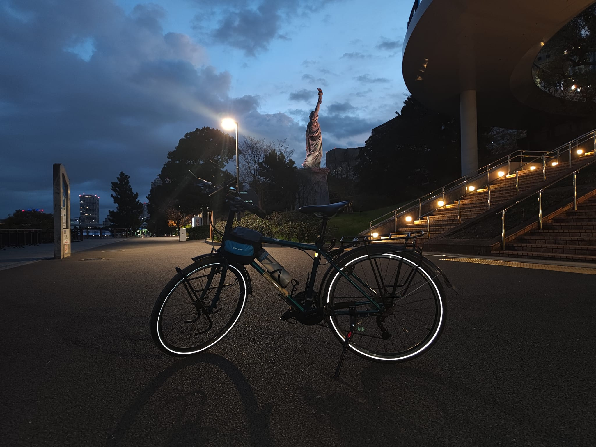
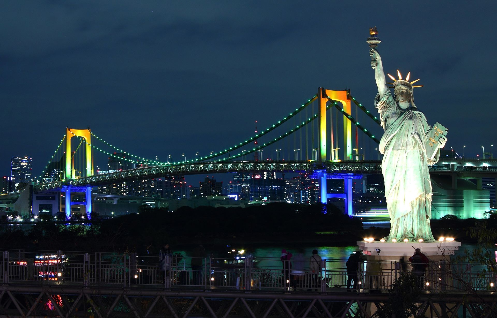

这边记录了某一天晚上睡不着,早上骑车去了台场的体验
<!--more-->

## 睡不着就去骑车

最近是经常失眠,所以常常是睡也没睡好,玩也没玩好,睡不着的时候就去骑车就好了,骑车回来,身心疲惫.
自然就容易睡着了,也不失为一个入睡的好办法,就是有点消耗体力,再加上最近着实是有点冷了.

## 骑行体验

从体验来说的话,一般,因为去台场的话要走大路,大路上红绿灯多,不过还好是早上五点出发的,路上车不是很多.回来的时候快八点了,路上车就多了起来了,骑行体验就很难受了.

台场有很多的高架桥,一不小心就容易走错路.

## 台场海滨公园

台场海滨公园还是挺不错的,远远地能看到东京塔.

还有一个自由女神像,更多关于自由女神像的由来请看wiki百科[自由の女神像 - Wikipedia](https://ja.wikipedia.org/wiki/%E8%87%AA%E7%94%B1%E3%81%AE%E5%A5%B3%E7%A5%9E%E5%83%8F#%E6%9D%B1%E4%BA%AC%E9%83%BD%E6%B8%AF%E5%8C%BA)

## 台场
`去台场的路上遇到的桥,远远看去有点像一个怪兽`

`自行车和自由女神的合影`

`感觉很有科技感的楼`

`台场的自由女神像`

`台场的希尔顿酒店`

