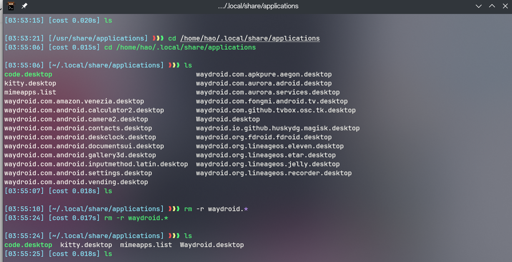

本文记录了使用linux遇到的各种问题
<!--more-->

## manjaro linux 中卸载waydroid后，遗留的安卓app图标如何删除？



## 把go加入环境变量
打开zshrc添加以下变量
```bash
export PATH=$PATH:/usr/lib/go/bin

```
## vscode设置字体
这样前一个英文字体是jetbrains 后一个就是喜欢的中文字体
```json
'JetBrains Mono','LXGW WenKai Mono Screen'
```

## 为ssh登录指定证书

```ssh
Host xxxx # host alias
    Hostname xx.xx.xx # ip address
    User root # user name for log in
    IdentityFile ~/.ssh/id_ed25519 

```