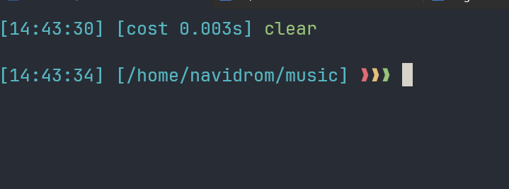
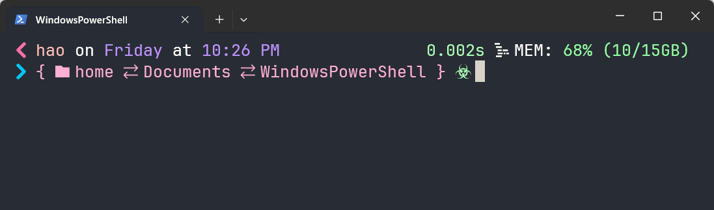

 我的shell配置

<!--more-->
## zsh
### 主题
[ChesterYue/ohmyzsh-theme-passion: An oh-my-zsh theme.](https://github.com/ChesterYue/ohmyzsh-theme-passion)




如果你也想试试这主题的话,按下面的顺序执行吧.

clone repo:
```bash
 git clone https://github.com/ChesterYue/ohmyzsh-theme-passion;
```
copy theme:
```bash
 cp ./ohmyzsh-theme-passion/passion.zsh-theme ~/.oh-my-zsh/themes/passion.zsh-theme;

```
打开 ~/.zshrc 找到 ZSH_THEME 然后改成 ZSH_THEME="passion";
然后让配置生效
```bash
source ~/.zshrc;
```

### 我的zsh插件

```bash

plugins=(git z vi-mode zsh-syntax-highlighting zsh-autosuggestions)

```
zsh-syntax-highlighting zsh-autosuggestions是第三方插件
需要从GitHub clone到本地的,其他的都是内置的功能

```bash
#需要clone的仓库
git clone https://github.com/zsh-users/zsh-autosuggestions ${ZSH_CUSTOM:-$HOME/.oh-my-zsh/custom}/plugins/zsh-autosuggestions
git clone https://github.com/zsh-users/zsh-syntax-highlighting ${ZSH_CUSTOM:-~/.oh-my-zsh/custom}/plugins/zsh-syntax-highlighting
```

## powershell 


### 效果



### 下载安装

下载oh-my-posh[Windows | Oh My Posh](https://ohmyposh.dev/docs/installation/windows)

windows 用户可以用winget 安装

```bash
winget install JanDeDobbeleer.OhMyPosh -s winget
```


### 配置
```powershell
# config
oh-my-posh init pwsh --config ~/1_shell.omp.json  | Invoke-Expression
```
主题配置文件 1_shell.omp.json

```json                                                                                                                                     
{                                                                                                                                                            
  "$schema": "https://raw.githubusercontent.com/JanDeDobbeleer/oh-my-posh/main/themes/schema.json",                                                          
  "blocks": [
    {
      "alignment": "left",
      "newline": true,
      "segments": [
        {
          "foreground": "#ffbebc",
          "leading_diamond": "<#ff70a6> \ue200 </>",
          "properties": {
            "display_host": true
          },
          "style": "diamond",
          "template": "{{ .UserName }} <#ffffff>on</>",
          "type": "session"
        },
        {
          "foreground": "#bc93ff",
          "properties": {
            "time_format": "Monday <#ffffff>at</> 3:04 PM"
          },
          "style": "diamond",
          "template": " {{ .CurrentDate | date .Format }} ",
          "type": "time"
        },
        {
          "foreground": "#ee79d1",
          "properties": {
            "branch_icon": "\ue725 ",
            "fetch_stash_count": true,
            "fetch_status": true,
            "fetch_upstream_icon": true,
            "fetch_worktree_count": true
          },
          "style": "diamond",
          "template": " {{ .UpstreamIcon }}{{ .HEAD }}{{if .BranchStatus }} {{ .BranchStatus }}{{ end }}{{ if .Working.Changed }} \uf044 {{ .Working.String }}{{ end }}{{ if and (.Working.Changed) (.Staging.Changed) }} |{{ end }}{{ if .Staging.Changed }} \uf046 {{ .Staging.String }}{{ end }}{{ if gt .StashCount 0 }} \ueb4b {{ .StashCount }}{{ end }} ",
          "type": "git"
        }
      ],
      "type": "prompt"
    },
    {
      "alignment": "right",
      "segments": [
        {
          "foreground": "#a9ffb4",
          "style": "plain",
          "type": "text"
        },
        {
          "foreground": "#a9ffb4",
          "properties": {
            "style": "dallas",
            "threshold": 0
          },
          "style": "diamond",
          "template": " {{ .FormattedMs }}s <#ffffff>\ue601</>",
          "type": "executiontime"
        },
        {
          "properties": {
            "root_icon": "\uf292 "
          },
          "style": "diamond",
          "template": " \uf0e7 ",
          "type": "root"
        },
        {
          "foreground": "#94ffa2",
          "style": "diamond",
          "template": " <#ffffff>MEM:</> {{ round .PhysicalPercentUsed .Precision }}% ({{ (div ((sub .PhysicalTotalMemory .PhysicalFreeMemory)|float64) 1073741824.0) }}/{{ (div .PhysicalTotalMemory 1073741824.0) }}GB)",
          "type": "sysinfo"
        }
      ],
      "type": "prompt"
    },
    {
      "alignment": "left",
      "newline": true,
      "segments": [
        {
          "foreground": "#ffafd2",
          "leading_diamond": "<#00c7fc> \ue285 </><#ffafd2>{</>",
          "properties": {
            "folder_icon": "\uf07b",
            "folder_separator_icon": " \uebcb ",
            "home_icon": "home",
            "style": "agnoster_full"
          },
          "style": "diamond",
          "template": " \ue5ff {{ .Path }} ",
          "trailing_diamond": "<#ffafd2>}</>",
          "type": "path"
        },
        {
          "foreground": "#A9FFB4",
          "foreground_templates": ["{{ if gt .Code 0 }}#ef5350{{ end }}"],
          "properties": {
            "always_enabled": true
          },
          "style": "plain",
          "template": " \ue286 ",
          "type": "status"
        }
      ],
      "type": "prompt"
    }
  ],
  "console_title_template": "{{ .Folder }}",
  "transient_prompt": {
    "background": "transparent",
    "foreground": "#FEF5ED",
    "template": "\ue285 "
  },
  "version": 3
}

```